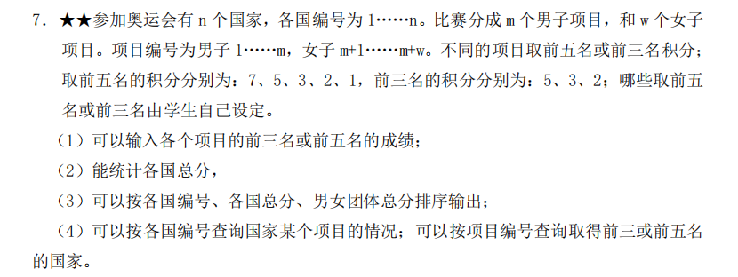

# 这是一份乱七八糟的说明

该GitHub仓库中的内容是同济大学数据结构课程设计的**综合实现部分内容**，对应学号尾号是**7**。  

上传的目的主要是给学弟学妹一个指北（**误**），你济计科作业真是好卷！但是在这门课上你也许不需要那么卷，指你可以不用非得去做 **三星题** 地铁和社交网络的题目，做好学号对应 **二星题** 也行（论据是本人选择该题也拿优了）。

在选题时出于对地铁的不喜欢和一些乱七八糟对奥运的好感，所以坚定选择了学号对应题目如下图↓ 

仓库内容是项目对应代码，此外有部分实现展示图片，仅供参考。你需要自己了解 **QT各种控件的功能和链接槽函数** ，从而好好利用UI文件完成界面设计，而不是像我最开始一样哐哐写代码设置UI。

### PS
如果需要算法实现部分题目排序可视化的参考，可以去<https://github.com/gongjianbo/VisualSort> 这个仓库进行参考，但需要注意的是，上述代码并没有实现输入数据功能，不过个人认为这个界面挺漂亮的，值得参考！

### PPS
不要开盒，感恩！